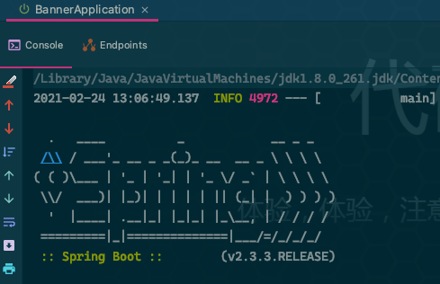

# SpringBanner

## 简介(What)

**Spring Banner 定义了应用启动时的界面。**

## Usage

### 默认

Spring提供了Banner的默认实现，效果如下：



### 模式

可以在SpringApplication的`run()`方法之前，通过`setBannerMode(Mode)`指定Banner的模式：`OFF`、`CONSOLE`、`LOG`，其中`OFF`用于关闭Banner，如下：

```java
SpringApplication.setBannerMode(Mode.OFF);
```

### 自定义

#### TextBanner

在`resources`目录下添加`banner.txt`[^spring-banner]文件，内容如下：

```
 _______  __  .__   __.      ___       __      
|   ____||  | |  \ |  |     /   \     |  |     
|  |__   |  | |   \|  |    /  ^  \    |  |     
|   __|  |  | |  . `  |   /  /_\  \   |  |     
|  |     |  | |  |\   |  /  _____  \  |  `----.
|__|     |__| |__| \__| /__/     \__\ |_______|
```

运行可在控制台看到如下内容：


> 可以通过`spring.banner.location`属性来指定`TextBanner`资源的位置，默认为`banner.txt`。

#### ImageBanner

还可以使用**图片**来指定Banner，支持的类型为：`git`、`jpg`、`png`，与`banner.txt`类似，在`resources`目录下添加`banner.gif`文件，如下图：


运行后可多个该图片的多个帧像：

```
                                 .:::::.   .*::::*                            
                               :::                ::*                         
                            *::                      ::.*::                   
                          .:*                          ::::.                  
                         o:                         ::::::::                  
                     :::::                      .:::::::::::                  
                 :::.              *:::::::::::::o::o::::::::                 
               ::             .:::::::::::::::::::::::::::::::.               
             ::             *:::::::::::::::::::::::::  :::::  ::.            
            ::             ::::::::::::::::::::::::: **::::::    ::           
            :              ::::::::::::::::::::::::.  .::::::     *:          
           ::             ::::::::::::::::::::::.*:  :::::::*      ::         
           ::             *::::::::::::::::::. : *: ::::::::       .:         
           *:              :::::::::::::.  ::  :  :::::::::        .:         
            :.              :*..       :.:  :   ::::::::::         ::         
            .:              :.*:   :  .* :  .:::::::::::          *:          
              ::           .:  :   :    .::::::::::*             ::           
               *::.         :::                               .::             
                  :::*                          ......****::::*               
                       .*::*****.....                                         
                      
                      
                      
                      
                                                                                               
                                                                              
                               *:::::::*      ..****..                        
                           *:.          .*::*         .*:*                    
                         ::          .:*      ::          :*                  
                       .:         .:*           ::         *:                 
                       :       .:::::::::::::::::*:*        :.                
                      :. *::* .:                    :*::*.   :                
                     *:*     :                       ::   .:*:                
                   :***    ::                          :     ::*              
                 ::  *.   :.         :::::::*           :    : *:.            
               ::    :* *:        .::::::::::::          :   :   **           
              *:     **::        .::::::::::::::         .: :*    **          
              :      .::         :::::::::::::::.         :*:      :.         
             .:      .:.         *::::::::::::::           :       :.         
              :      :.:          ::::::::::::::          ::.      :          
              **    .: :.           ::::::::::           ::**     ::          
               *:.  :   :.                              :* .:    ::           
                .** :    :*                            :   .*  ::             
                  .::     :*                         *:    ***:               
                    :*:*.  ::                       :     *::                 
                    :   .*::*:                    :. *::* .:                  
                    .:        *:*:::::::::::::::::.       :                   
                     :*         ::           .:*         :.                   
                      .:.         :::     *:.          *:                     
                        .::.         *::*           .::                       
                             ..**...      *::::::::                           
                                                                              
                                                                              
                                                                             
```

> **ImageBanner**是将图像中的每一帧转换为`TextBanner`，因此`git`的Banner会出现多个。
>
> 可以通过`spring.banner.image.location`属性来指定`ImageBanner`资源的位置，默认为`banner.{ext}`。

### Properties


```yaml
spring:
	banner:
		location: classpath:banner.txt # TextBanner 资源位置，默认为 classpath:banner.txt
		image:
			location: classpath:banner.gif # ImageBanner 资源位置，默认为 classpath:banner.gif(jpg|png)
```


## When

在`SpringApplication`的`run()`方法中，通过调用`printBanner(environment)`方法来打印Banner。

```java
package org.springframework.boot;

public class SpringApplication {

    private Banner printBanner(ConfigurableEnvironment environment) {
        if (this.bannerMode == Banner.Mode.OFF) {
            return null;
        }
        ResourceLoader resourceLoader = (this.resourceLoader != null) ? this.resourceLoader
            : new DefaultResourceLoader(null);
        SpringApplicationBannerPrinter bannerPrinter = new SpringApplicationBannerPrinter(resourceLoader, this.banner);
        if (this.bannerMode == Mode.LOG) {
            return bannerPrinter.print(environment, this.mainApplicationClass, logger);
        }
        return bannerPrinter.print(environment, this.mainApplicationClass, System.out);
    }

}
```

在该方法中，通过创建`SpringApplicationBannerPrinter`的实例调用`print()`方法来打印Banner:

## How

在`SpringApplication`的`printBanner(environment)`方法中

### SpringApplicationBannerPrinter

`SpringApplicationBannerPrinter`实现了Banner的加载和打印，核心流程如下：

1. 获取Banner
   1. `getImageBanner()`：获取`spring.banner.image.location`属性指定的资源，如果未指定，则顺序加载`resources`目录下的`banner.git`、`banner.jpg`、`banner.png`。
   2. `getTextBanner()`：获取`spring.banner.location`属性指定的资源，默认为`banner.txt`。
   3. `DEFAULT_BANNER`：由`SpringBootBanner`创建的默认资源。
2. 打印Banner

```java
package org.springframework.boot;

class SpringApplicationBannerPrinter {
    
    // TEXT BANNER LOCATION 属性 KEY，用于指定 textBanner 资源的位置
    static final String BANNER_LOCATION_PROPERTY = "spring.banner.location";
    
    // IMAGE BANNER LOCATION 属性 KEY，用于指定 imageBanner 资源的位置
    static final String BANNER_IMAGE_LOCATION_PROPERTY = "spring.banner.image.location";

    // 默认的 TextBanner 的资源 banner.txt
    static final String DEFAULT_BANNER_LOCATION = "banner.txt";

    // 支持的 ImageBanner 的类型
    static final String[] IMAGE_EXTENSION = { "gif", "jpg", "png" };

    // 默认的 Banner
    private static final Banner DEFAULT_BANNER = new SpringBootBanner();

    private final ResourceLoader resourceLoader;

    private final Banner fallbackBanner;

    SpringApplicationBannerPrinter(ResourceLoader resourceLoader, Banner fallbackBanner) {
        this.resourceLoader = resourceLoader;
        this.fallbackBanner = fallbackBanner;
    }

    Banner print(Environment environment, Class<?> sourceClass, Log logger) {
        // 加载Banner
        Banner banner = getBanner(environment);
        try {
            logger.info(createStringFromBanner(banner, environment, sourceClass));
        }
        catch (UnsupportedEncodingException ex) {
            logger.warn("Failed to create String for banner", ex);
        }
        return new PrintedBanner(banner, sourceClass);
    }

    Banner print(Environment environment, Class<?> sourceClass, PrintStream out) {
        Banner banner = getBanner(environment);
        banner.printBanner(environment, sourceClass, out);
        return new PrintedBanner(banner, sourceClass);
    }

    private Banner getBanner(Environment environment) {
        Banners banners = new Banners();
        banners.addIfNotNull(getImageBanner(environment));
        banners.addIfNotNull(getTextBanner(environment));
        if (banners.hasAtLeastOneBanner()) {
            return banners;
        }
        if (this.fallbackBanner != null) {
            return this.fallbackBanner;
        }
        return DEFAULT_BANNER;
    }

    // 加载 TextBanner
    private Banner getTextBanner(Environment environment) {
        String location = environment.getProperty(BANNER_LOCATION_PROPERTY, DEFAULT_BANNER_LOCATION);
        Resource resource = this.resourceLoader.getResource(location);
        if (resource.exists()) {
            return new ResourceBanner(resource);
        }
        return null;
    }

    // 加载 ImageBanner
    private Banner getImageBanner(Environment environment) {
        String location = environment.getProperty(BANNER_IMAGE_LOCATION_PROPERTY);
        if (StringUtils.hasLength(location)) {
            Resource resource = this.resourceLoader.getResource(location);
            return resource.exists() ? new ImageBanner(resource) : null;
        }
        for (String ext : IMAGE_EXTENSION) {
            Resource resource = this.resourceLoader.getResource("banner." + ext);
            if (resource.exists()) {
                return new ImageBanner(resource);
            }
        }
        return null;
    }

}
```


### SpringBootBanner

```java
package org.springframework.boot;

class SpringBootBanner implements Banner {

    private static final String[] BANNER = {"",
        "  .   ____          _            __ _ _",
        " /\\\\ / ___'_ __ _ _(_)_ __  __ _ \\ \\ \\ \\",
        "( ( )\\___ | '_ | '_| | '_ \\/ _` | \\ \\ \\ \\",
        " \\\\/  ___)| |_)| | | | | || (_| |  ) ) ) )",
        "  '  |____| .__|_| |_|_| |_\\__, | / / / /",
        " =========|_|==============|___/=/_/_/_/"};

    private static final String SPRING_BOOT = " :: Spring Boot :: ";

    private static final int STRAP_LINE_SIZE = 42;

    @Override
    public void printBanner(Environment environment, Class<?> sourceClass, PrintStream printStream) {
        for (String line : BANNER) {
            printStream.println(line);
        }
        String version = SpringBootVersion.getVersion();
        version = (version != null) ? " (v" + version + ")" : "";
        StringBuilder padding = new StringBuilder();
        while (padding.length() < STRAP_LINE_SIZE - (version.length() + SPRING_BOOT.length())) {
            padding.append(" ");
        }

        printStream.println(AnsiOutput.toString(AnsiColor.GREEN, SPRING_BOOT, AnsiColor.DEFAULT, padding.toString(),
            AnsiStyle.FAINT, version));
        printStream.println();
    }

}
```


## Summary

本文叙述了Spring应用Banner的用法及原理，Banner可应用于描述应用的组织、功能或版本信息等。


[^spring-banner]: Spring Banner 可在[网站](https://www.bootschool.net/ascii)在线生成。